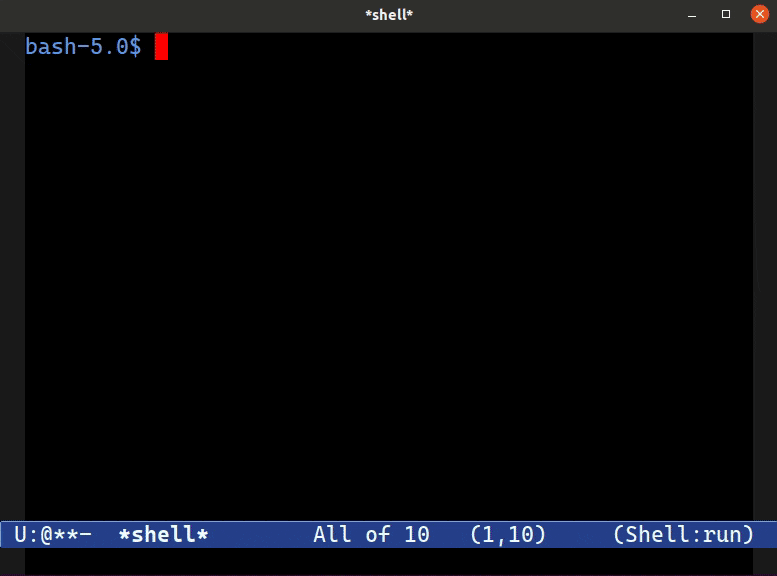

====================
 Emacs Fuzzy Finder
====================

Emacs Fuzzy Finder is like `fzf <https://github.com/junegunn/fzf>`__, but it leverages the power of your Emacs instance to filter and select candidates.

Use ``ezf`` as part of your piping and command substitutions to manually select and filter matches.

Here's an example::

   apt-get install $(apt-cache search emacs | ezf -f 1)

This will search Debian's package repository for anything with the word ``emacs`` in it -- yielding hundreds of results. They're then passed to ``ezf`` and you're asked to filter and select candidates inside your own Emacs. The ones you select are sent *back* to the shell, and substituted into the call to ``apt-get``.

To better understand how and why it works the way it does, you can read my article `Fuzzy Finding with Emacs instead of fzf <https://www.masteringemacs.org/article/fuzzy-finding-emacs-instead-of-fzf>`__.

How to Install
==============

1. Git clone the repo
2. Put ``ezf`` somewhere in your ``PATH``.
3. Load ``ezf.el``.
